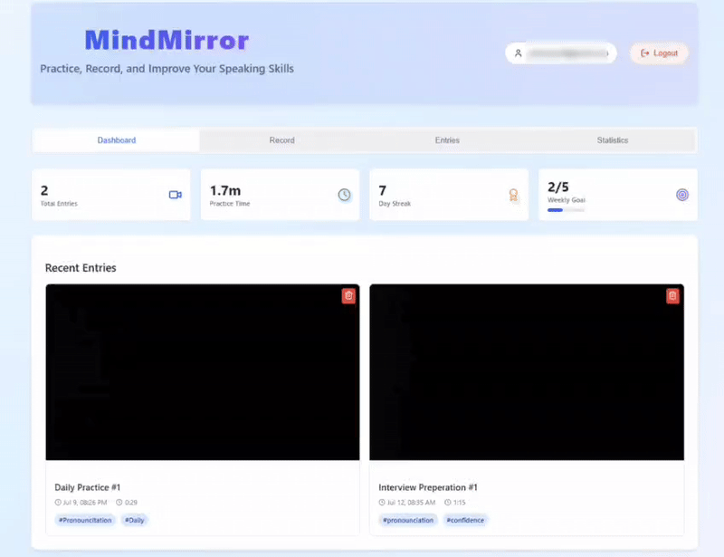

# MindMirror

*Reflect. Record. Remember. Grow.*

---

## Table of Contents

- [Overview](#overview)
- [Features](#features)
- [Demo](#demo)
- [Getting Started](#getting-started)
  - [Prerequisites](#prerequisites)
  - [Installation](#installation)
  - [Usage](#usage)
  - [Testing](#testing)
- [Contributing](#contributing)
- [License](#license)
- [Acknowledgments](#acknowledgments)

---

## Overview

MindMirror is a personal video journaling app that helps users improve their communication, record daily reflections, and grow over time through private entries.

**Why MindMirror?**

- Automated code summarization and intuitive UI
- Detailed entry storage with tags, videos, and timestamps
- Offline support using IndexedDB for local video storage
- Firebase-based authentication
- Clean separation of components for form, viewer, and recorder

---
## Features

MindMirror is a video journaling tool designed to support personal reflection and communication growth. It offers the following capabilities:

- **Record video entries directly in your browser**  
  Use your webcam to capture thoughts and reflections without needing any external tools. Videos are recorded and previewed instantly.

- **Store recordings locally for complete privacy**  
  All video data is saved securely in your browser using IndexedDB. Nothing is uploaded to a server, so your journal stays with you.

- **Add titles, tags, and notes to each entry**  
  Each journal entry can be organized with a title and relevant tags, making it easier to search and revisit later.

- **View and manage past entries**  
  Browse all your recorded entries in one place. You can delete entries you no longer need or rewatch previous reflections.

- **Simple authentication to keep entries user-specific**  
  Firebase authentication ensures that each user accesses only their own journal data.
- **Designed for daily reflection and growth**  
  MindMirror encourages consistency and mindfulness, helping users track their journey and communication progress over time.

---

## Demo




---

## Getting Started

### Prerequisites

- Node.js (>= 14.x)
- npm or yarn
- Firebase project setup (with Auth enabled)

### Installation

1. Clone the repository:

```bash
git clone https://github.com/your-username/MindMirror.git
````

2. Navigate to the frontend directory:

```bash
cd MindMirror/frontend
```

3. Install the dependencies:

```bash
npm install
```

### Usage

Start the development server:

```bash
npm start
```

### Testing

To run tests:

```bash
npm test
```

---

## Contributing

1. Fork the repo
2. Create your feature branch: `git checkout -b feature/your-feature-name`
3. Commit your changes: `git commit -m 'Add some feature'`
4. Push to the branch: `git push origin feature/your-feature-name`
5. Open a pull request

---

## License

This project is licensed under the [MIT License](https://choosealicense.com/licenses/mit/).

---

## Acknowledgments

* Firebase Auth & Firestore Docs
* IndexedDB API
* React Community and Libraries


